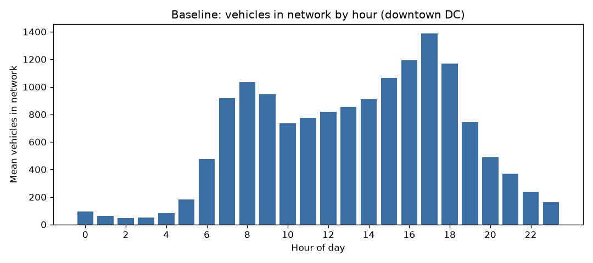
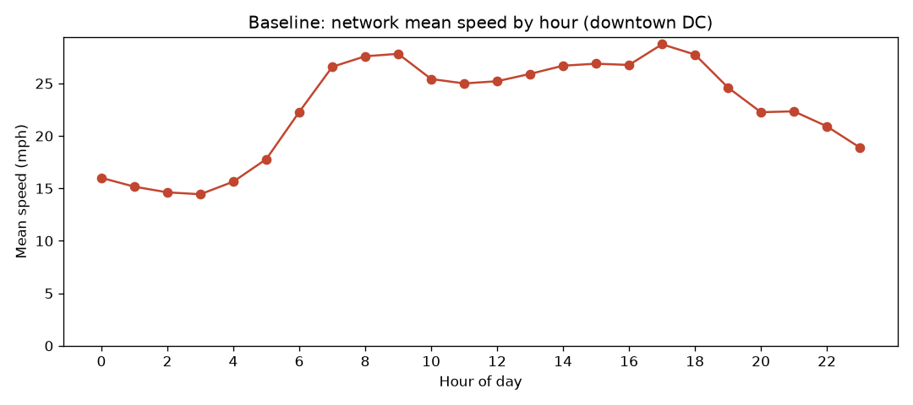

# Downtown DC Baseline — Traffic Metrics (Control, no V2X)

Scenario: **downtown_dc_baseline** · window: **24h** · demand calibrated to DDOT AADT counts.

## Headline KPIs

| Metric | Value |
|---|---|
| Vehicles loaded | 939,225 |
| Completed trips | 187,684 |
| Mean travel time | 284 s |
| Mean delay (time loss) | 228 s |
| Mean waiting time | 108 s |
| Mean trip length | 0.99 km |
| Mean speed | 13.7 mph |
| Total delay | 11,866 veh-hours |
| Total distance | 185,777 veh-km |

## Diurnal pattern

## Worst edges by total waiting time

| Edge | Total waiting (s) | Mean speed (mph) |
|---|---|---|

---
*This is the frozen control. V2X experiments are evaluated as deltas against `metrics.json`.*
